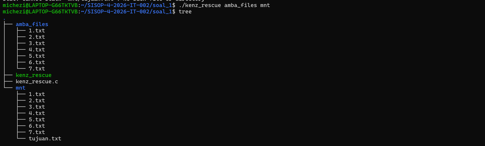
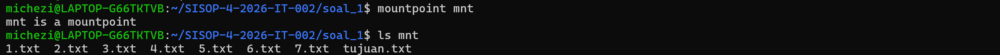
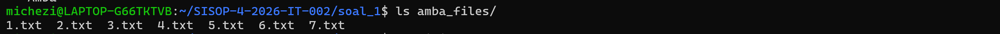
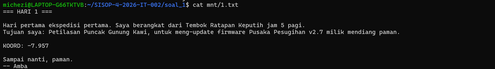
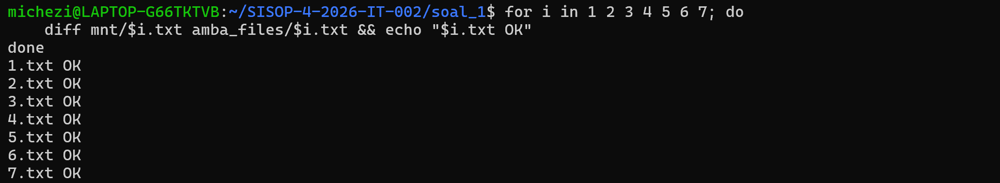
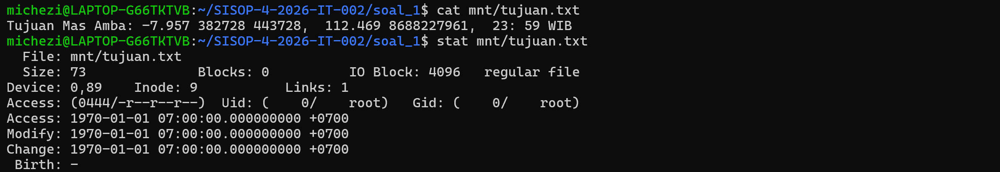

# SISOP-1-2026-IT-002
## Soal 1
Pada soal ini diminta untuk membuat sebuah filesystem virtual menggunakan FUSE (Filesystem in Userspace). Filesystem virtual ini digunakan untuk melakukan mount terhadap folder asli bernama `amba_files` ke sebuah mount point bernama `mnt`. Seluruh file yang berada di dalam `amba_files` harus dapat diakses melalui folder mount tersebut tanpa memindahkan file aslinya.
Selain itu, program juga diminta untuk membuat file virtual tambahan bernama `tujuan.txt`. File ini tidak boleh ada secara fisik di dalam folder `amba_files`, melainkan dibuat langsung oleh program FUSE saat filesystem diakses. Dengan demikian, user akan melihat seolah-olah file tersebut benar-benar ada pada filesystem.
Melalui soal ini dipelajari beberapa konsep penting pada sistem operasi Linux, seperti:
- Filesystem virtual menggunakan FUSE
- Konsep mount point
- Callback filesystem pada userspace
- Operasi dasar filesystem seperti `getattr`, `readdir`, `open`, dan `read`
- Passthrough filesystem

### Penjelasan Program
Program bekerja dengan cara:
- Linux melakukan mount ke folder mnt
- Semua request filesystem dialihkan ke program FUSE
- Program membaca file asli dari amba_files
- Program membuat file virtual tujuan.txt
- User hanya melihat hasil virtual filesystem
### Kode Lengkap
```c
#include <fuse.h>
#include <stdio.h>
#include <string.h>
#include <errno.h>
#include <fcntl.h>
#include <unistd.h>
#include <dirent.h>

static const char *source_dir = "amba_files";

static int kenz_getattr(const char *path, struct stat *stbuf)
{
    int res;
    char fpath[1000];

    memset(stbuf, 0, sizeof(struct stat));

    if (strcmp(path, "/") == 0) {
        stbuf->st_mode = S_IFDIR | 0755;
        stbuf->st_nlink = 2;
        return 0;
    }

    if (strcmp(path, "/tujuan.txt") == 0) {
        stbuf->st_mode = S_IFREG | 0444;
        stbuf->st_nlink = 1;
        stbuf->st_size = 33;
        return 0;
    }

    sprintf(fpath, "%s%s", source_dir, path);

    res = lstat(fpath, stbuf);

    if (res == -1)
        return -errno;

    return 0;
}
```
### Penjelasan Kode
#### 1. FUSE Version
```
#define FUSE_USE_VERSION 28
```
Digunakan untuk menentukan versi API FUSE yang dipakai.

#### 2. Source Directory
```
static const char *source_dir = "amba_files";
```
Menentukan lokasi file asli.
Semua file asli akan dibaca dari folder:
```
amba_files/
```
#### 3. getattr()
```
static int kenz_getattr(...)
```
Fungsi ini dipanggil Linux setiap kali:
- mengecek file
- melakukan ls
- membuka file

Fungsi ini menentukan:
- apakah file ada
- apakah file folder atau regular file
- ukuran file
- permission file
#### 4. Virtual File
```
if (strcmp(path, "/tujuan.txt") == 0)
```
Digunakan untuk membuat file virtual.
File ini:
- tidak ada secara fisik
- hanya muncul di mountpoint
- dibuat langsung oleh program
#### 5. readdir()
```
static int kenz_readdir(...)
```
Fungsi ini dipanggil saat:
```
ls mnt
```
Program membaca seluruh isi:
```
amba_files
```
lalu menampilkannya di:
```
mnt
```
#### 6. filler()
```
filler(buf, de->d_name, NULL, 0);
```
Digunakan untuk menambahkan file ke tampilan directory.
#### 7. open()
```
static int kenz_open(...)
```
Digunakan saat file dibuka.
Program akan membuka file asli dari:
```
amba_files
```
#### 8. read()
```
static int kenz_read(...)
```
Digunakan untuk membaca isi file.
Fungsi ini:
- membaca file asli
- mengirim isi file ke user

### Cara Menjalankan
#### compile
```
gcc kenz_rescue.c -o kenz_rescue `pkg-config fuse --cflags --libs`
```
#### Mount
```
mkdir -p mnt
./kenz_rescue mnt
```
#### Testing
```
ls mnt
cat mnt/1.txt
cat mnt/tujuan.txt
```
#### Unmount
```
fusermount -u mnt
```
### Output
#### 1. Menjalankan Program FUSE

#### 2. Melihat Isi File Pada Mount Point

#### 3. Memastikan File Asli Pada `amba_files`

#### 4. Membaca Isi File Melalui Filesystem Virtual

#### 5. Memverifikasi Semua File Mount Sama Dengan File Asli

#### 6. Membaca File Virtual `tujuan.txt`

